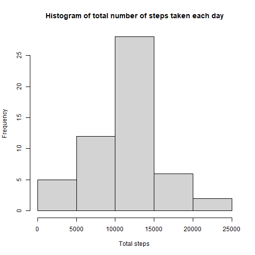
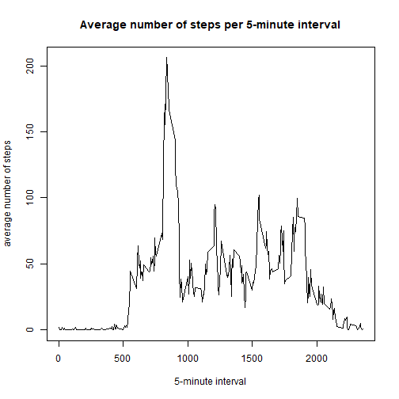
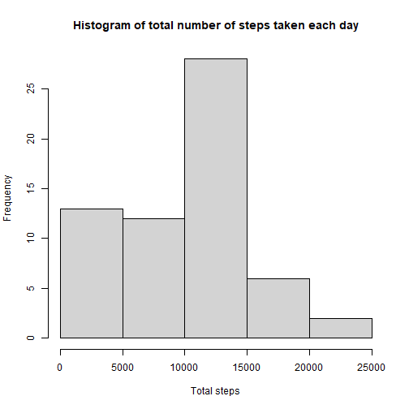
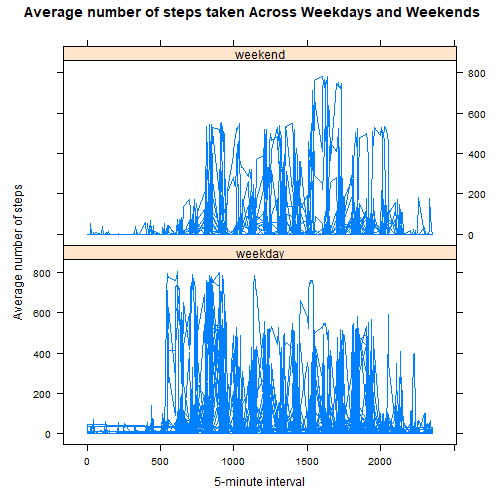

## Load and preprocess the data.


```r
ds <- read.csv("activity.csv")
ds$date <- as.Date(ds$date)
```

## Calculate the total number of steps taken per day.


```r
total_steps_per_day <- aggregate(steps ~ date, data = ds, FUN = sum)
```

## Make a histogram of the total number of steps taken each day.


```r
hist(total_steps_per_day$steps,
     main = "Histogram of total number of steps taken each day",
     xlab = "Total steps",
     ylab = "Frequency")
```



## Calculate and report the mean and median of the total number of steps taken per day.


```r
# Calculate mean and median
mean_steps <- round(mean(total_steps_per_day$steps))
median_steps <- round(median(total_steps_per_day$steps))

# Report the results
print(paste("Mean steps per day:", mean_steps))
```

```
## [1] "Mean steps per day: 10766"
```

```r
print(paste("Median steps per day:", median_steps))
```

```
## [1] "Median steps per day: 10765"
```

## Make a time series plot of the 5-minute interval and the average number of steps taken, averaged across all days.


```r
# Calculate average number of steps for each 5-minute interval
avg_steps_per_interval <- aggregate(steps ~ interval, data = ds, FUN = mean)

# Create time series plot
plot(avg_steps_per_interval$interval, 
     avg_steps_per_interval$steps, 
     type = "l", 
     xlab = "5-minute interval", 
     ylab = "average number of steps",
     main = "Average number of steps per 5-minute interval")
```



## Which 5-minute interval, on average across all the days in the dataset, contains the maximum number of steps?


```r
# Find the interval with maximum average steps
max_avg_interval <- avg_steps_per_interval$interval[which.max(avg_steps_per_interval$steps)]

# Print the result
print(paste("The 5-minute interval with the maximum average number of steps is:", max_avg_interval))
```

```
## [1] "The 5-minute interval with the maximum average number of steps is: 835"
```

## Calculate and report the total number of missing values in the dataset.


```r
total_missing_values <- sum(is.na(ds$steps) | is.na(ds$date) | is.na(ds$interval))
print(total_missing_values)
```

```
## [1] 2304
```

## Devise a strategy for filling in all of the missing values in the dataset and create a new dataset that is equal to the original dataset but with the missing data filled in.


```r
# Group the data by 'date'
grouped_data <- split(ds$steps, ds$date)

# Calculate the mean value for the 'steps' column within each group
mean_values <- lapply(grouped_data, function(x) {
  mean_value <- mean(x, na.rm = TRUE)
  if (is.nan(mean_value)) mean_value <- 0  # Replace NaN with 0
  return(mean_value)
})

# Create a copy of the original dataframe
filled_ds <- ds

# Replace missing values in the 'steps' column with corresponding mean values for that day
for (date in names(mean_values)) {
  idx <- filled_ds$date == date
  filled_ds$steps[idx] <- ifelse(is.na(filled_ds$steps[idx]), mean_values[[date]], filled_ds$steps[idx])
}
```

## Make a histogram of the total number of steps taken each day.


```r
new_total_steps_per_day <- aggregate(steps ~ date, data = filled_ds, FUN = sum)
hist(new_total_steps_per_day$steps,
     main = "Histogram of total number of steps taken each day",
     xlab = "Total steps",
     ylab = "Frequency")
```



## Calculate and report the mean and median of the total number of steps taken per day.


```r
# Calculate mean and median
new_mean_steps <- round(mean(new_total_steps_per_day$steps))
new_median_steps <- round(median(new_total_steps_per_day$steps))

# Report the results
print(paste("Mean steps per day:", new_mean_steps))
```

```
## [1] "Mean steps per day: 9354"
```

```r
print(paste("Median steps per day:", new_median_steps))
```

```
## [1] "Median steps per day: 10395"
```

## Do these values differ from the estimates from the first part of the assignment?


```r
# Create a data frame with the old and new values as columns
stats_ds <- data.frame(Old_Values = c(mean_steps, median_steps),
                       New_Values = c(new_mean_steps, new_median_steps),
                       row.names = c("Mean", "Median"))

# Print the table
print(stats_ds)
```

```
##        Old_Values New_Values
## Mean        10766       9354
## Median      10765      10395
```

## What is the impact of imputing missing data on the estimates of the total daily number of steps?

### Both estimates decrease, especially the mean.

## Create a new factor variable in the dataset with two levels -- "weekday" and "weekend" indicating whether a given date is a weekday or weekend day.


```r
# Determine the day of the week for each date
filled_ds$day_of_week <- weekdays(filled_ds$date)

# Create a new variable indicating weekday or weekend
filled_ds$weekday_type <- ifelse(filled_ds$day_of_week %in% c("Saturday", "Sunday"), "weekend", "weekday")

# Convert 'weekday_type' to factor
filled_ds$weekday_type <- factor(filled_ds$weekday_type, levels = c("weekday", "weekend"))
```

## Make a panel plot containing a time series plot of the 5-minute interval and the average number of steps taken, averaged across all weekday days or weekend days (y-axis).


```r
# Load the lattice package
library(lattice)

# Create the panel plot
xyplot(steps ~ interval | weekday_type, data = filled_ds, type = "l",
       xlab = "5-minute interval", ylab = "Average number of steps",
       layout = c(1, 2),  # 2 rows, 1 column
       main = "Average number of steps taken Across Weekdays and Weekends")
```


